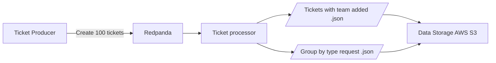
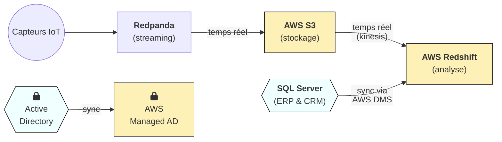

# 🚀 Projet : Modéliser une infrastructure dans le cloud
✨ Auteur : Maëva Beauvillain
📅 Date de début : mars 2025
📅 Dernière MAJ : 31 mars 2025

## Contexte
InduTechData est une entreprise spécialisée dans l’analyse de données pour le secteur industriel. Dans le cadre de son projet de modernisation de l’infrastructure et de gestion des données IoT, un POC a été mis en place pour la gestion des tickets clients en temps réel.

Le but de ce projet est de mettre en place un pipeline de données permettant de :

- Ingérer des tickets clients en temps réel dans un cluster Redpanda.
- Traiter ces tickets à l’aide de PySpark pour en extraire des informations pertinentes et générer des rapports.

## Objectifs
- **Ingestion des tickets en temps réel** : Utiliser Redpanda pour ingérer des tickets clients en temps réel, contenant des informations sur la demande du client.
- **Traitement des données** : Utiliser PySpark pour analyser ces données, générer des rapports et extraire des insights.
- **Stockage et visualisation** : Exporter les résultats traités vers un système de stockage (comme AWS S3) pour la visualisation des résultats.

## Architecture
Voici un schéma de flux des données, montrant les différentes étapes du pipeline de traitement des tickets clients, depuis la génération des tickets jusqu'à leur traitement :



- **Ticket Producer** : Génère les tickets clients en temps réel et les envoie dans Redpanda.
- **Redpanda** : Stocke les tickets clients dans un cluster Kafka-compatible pour une gestion en temps réel.
- **PySpark Processor** : Lit les données de Redpanda, les transforme et les analyse.
- **Data Storage** : Les données traitées sont stockées dans un service cloud AWS S3.

## Stack Technique
- **Redpanda** : Système de gestion de flux de données basé sur Kafka, utilisé pour l’ingestion en temps réel des tickets clients.
- **PySpark** : Framework pour le traitement distribué de données volumineuses, utilisé pour analyser les tickets.
- **AWS** : Service cloud utilisé pour le stockage des données traitées (par exemple S3).
- **Docker** : Conteneurisation de l’ensemble des services pour une exécution simplifiée.

## Prérequis
Avant de démarrer le projet, assurez-vous d’avoir les éléments suivants installés sur votre machine :

- Docker et Docker Compose
- Accès à un service AWS pour le stockage des résultats (S3)

## Installation
1. Clonez le repository :

````bash
git clone https://github.com/votre-utilisateur/p9_data_pipeline_redpanda_pyspark.git
cd p9_data_pipeline_redpanda_pyspark
````

2. Configurez les environnements (infos AWS S3) dans le fichier .env à la racine du projet.

3. Construisez les services Docker :

````bash
docker-compose up -d --build
````

Cette commande démarrera tous les services nécessaires à l'exécution du POC :
- Redpanda pour l’ingestion des tickets.
- Ticket Producer pour générer des tickets.
- Ticket Processor pour traiter les tickets avec PySpark.
- Redpanda Console pour visualiser les données et interagir avec le cluster Redpanda.

## Utilisation
#### Générer des tickets
Les tickets sont générés automatiquement par le service **Ticket Producer**. Ces tickets contiennent des informations générées aléatoirement telles que l'ID du client, la demande, la priorité, et sont envoyés à Redpanda pour traitement (par défaut 100 tickets sont générés, modifier la variable nb_tickets si besoin).

### Analyser les tickets avec PySpark
Le service **Ticket Processor** utilise PySpark pour lire les tickets depuis Redpanda et effectuer des analyses en temps réel. Il attibut le ticket à une équipe selon le type de la demande et effectue une aggréagation par type de demandes.
 Vous pouvez personnaliser les scripts PySpark pour ajuster les analyses selon vos besoins.

### Visualisation des résultats
Les tickets traités et les aggrégations sont stockés dans S3 en format json pour une analyse future plus approfondie.

### Vidéo de démonstration
Une démonstration vidéo du pipeline ETL en action est disponible **[ici](https://www.youtube.com/watch?v=9nHeqhERQYE)**. La vidéo couvre :

- La génération des tickets en temps réel.
- Leur ingestion dans Redpanda.
- Le traitement des données avec PySpark.
- La visualisation des résultats dans S3.

## Conclusion
Ce POC démontre la faisabilité de la gestion de tickets clients en temps réel avec une architecture hybride, utilisant Redpanda pour l'ingestion des données, PySpark pour le traitement des données et AWS pour le stockage des résultats.

## À propos
Ce projet fait partie d'un effort plus large pour moderniser l’infrastructure de gestion des données d’InduTechData en exploitant les services cloud tout en garantissant l’interopérabilité avec l’infrastructure existante.

Voici le flux de données du projet global depuis les différentes sources : 

